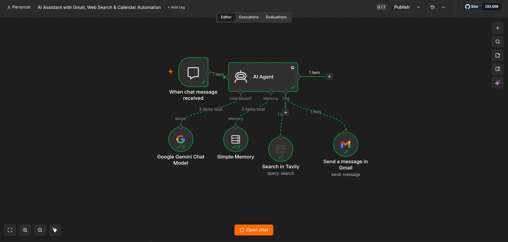
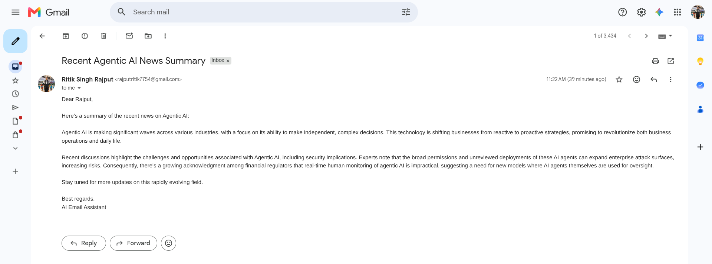

# 🤖 AI Email Assistant using n8n

An AI-powered workflow that automates email communication using AI Agents and external tools.

## Features

- 📧 Send professional emails
- 🌐 Search the web
- 🧠 Conversation memory
- 🤖 LLM-powered reasoning

## Tech Stack

- n8n
- Google Gemini / OpenAI
- Gmail
- Tavily Search
- AI Agent

## Workflow

1. User sends a message.
2. AI Agent understands the request.
3. Uses tools like Gmail or Web Search.
4. Performs the requested action.
5. Returns a confirmation..

## Screenshot

## Input

## Workflow

## Output

## Import

[Download AI Email Agent](Workflow/AI_Email_Agent.json)

## Author

Ritik Singh Rajput
